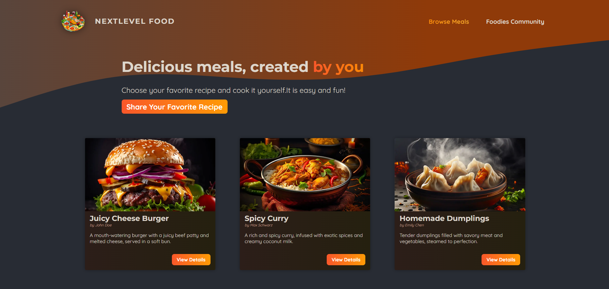

Welcome to the **Food Next App**! This project is built using **Next.js** and aims to provide a seamless food ordering experience.

## **Table of Contents**

- **[Overview](#overview)**
- **[Features](#features)**
- **[Technologies](#technologies)**
- **[Setup and Installation](#setup-and-installation)**
- **[Usage](#usage)**

## **Overview**

**Food Next App** is a web application designed to simplify the process of ordering food online. With a modern UI and intuitive navigation, users can browse through a wide range of dishes, select items, and place orders quickly.

## **Features**

  - 📝 Recipe Creation: Create and manage your own recipes with ingredients and instructions.
  - 🍽️ Recipe Collection: Browse and explore a variety of recipes from different categories.
  - 🔍 Search Functionality: Easily search for recipes by name, ingredients, or category.
  - 📱 Responsive Design: Optimized for both desktop and mobile use.

## **Technologies**

- **Next.js**: Frontend framework for building fast, server-side rendered applications.
- **CSS Modules**: Scoped CSS for styling components.
- **API Integration**: Uses RESTful APIs for fetching menu items and handling orders.

## **Screenshot**

